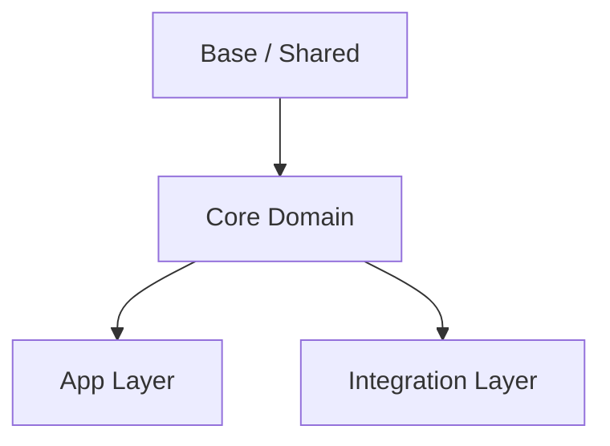
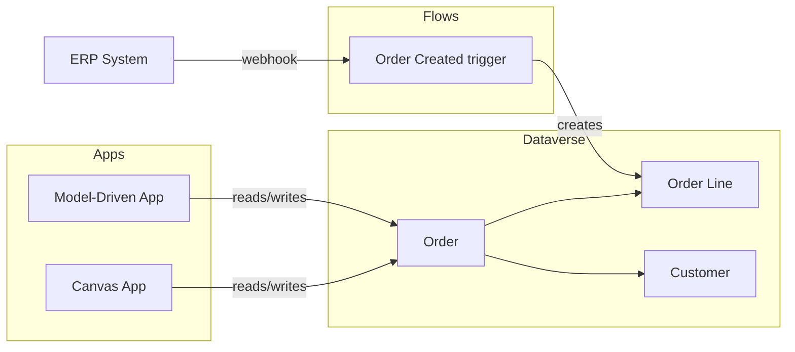
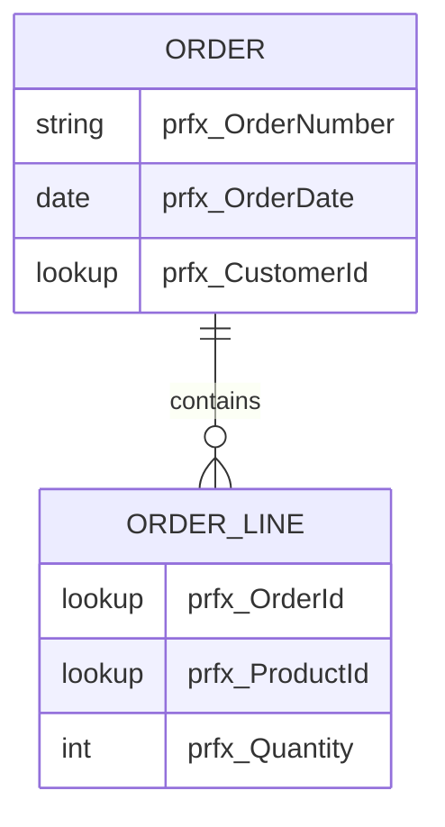

## Official skill

No official Microsoft skill exists for this topic. This skill covers project-level scaffolding conventions only.

## Folder structure

Every Power Platform project repository uses the following canonical layout. Create this structure before writing any code or running any PAC CLI commands.

```
<repo-root>/
├── CLAUDE.md            # Agent instructions and project context for Claude Code
├── README.md            # Human-facing project overview
│
├── data/
│   ├── model/           # Dataverse data-model specifications
│   │   └── *.md         # One file per table group or domain (ERD in Mermaid, full column spec)
│   ├── scripts/         # Python scripts that create tables, columns, and choices
│   │   └── *.py         # Written with the dataverse:dv-metadata / ppbp-dv-metadata skill
│   └── import/          # Python scripts that load records into Dataverse
│       └── *.py         # Real customer data or mock/seed data; written with dataverse:dv-data
│
├── codeapps/
│   └── <app-name>/      # One subfolder per Code App
│
├── plugins/
│   └── <plugin-name>/   # One subfolder per Dataverse Plugin project
│
└── genpages/
    └── <model-app-name>/
        └── <page-name>/ # One subfolder per Generative Page inside the model-driven app
```

### Folder responsibilities

| Folder | Content | Relevant skill |
|---|---|---|
| `data/model/` | `.md` files with table specs and Mermaid ERDs | `ppbp-dv-metadata` |
| `data/scripts/` | Python schema-setup scripts | `dataverse:dv-metadata`, `ppbp-dv-metadata` |
| `data/import/` | Python data-import scripts | `dataverse:dv-data` |
| `codeapps/<app>/` | React/Vite Code App source | `code-apps-preview:create-code-app`, `ppbp-code-apps` |
| `plugins/<plugin>/` | C# Dataverse Plugin projects | `ppbp-dv-plugins` |
| `genpages/<app>/<page>/` | TypeScript/Fluent UI Generative Pages | `model-apps:genpage`, `ppbp-generative-pages` |

## README and CLAUDE.md

### README.md (root)

README.md is the **single source of project truth**. All project-specific context lives here; CLAUDE.md references it rather than duplicating it.

Required sections, in order:

**1. Project overview**
- Project name, one-paragraph functional description.
- Business context: what problem it solves, who the end users are.

**2. Environments**

| Environment | URL | Purpose |
|---|---|---|
| Dev | `https://<org>.crm.dynamics.com` | Active development |
| Test | `https://<org>.crm.dynamics.com` | QA / UAT |
| Prod | `https://<org>.crm.dynamics.com` | Production |

**3. Publisher and project code**
- **Publisher prefix** — the `prfx_` used for all custom Dataverse objects (tables, columns, choices, flows, plugins).
- **Project code** — short code appended after the prefix in shared environments to avoid collisions: `prfx_<code>_TableName`.
- Shared environment? Yes/No — if yes, state which other projects share the same publisher.

**4. Power Platform solutions**

One row or subsection per solution. For each solution provide:

| Field | Description |
|---|---|
| Functional name | Human-readable name shown in the UI |
| Technical name (unique name) | Exact string used in PAC CLI and pipelines |
| Purpose | One sentence: what this solution contains and why |
| Contains | Bullet list of asset types included (tables, flows, apps, plugins…) |
| Must NOT contain | Asset types or specific objects that belong in a different solution |
| Depends on | Ordered list of solutions that must be imported first |

Represent the full dependency chain as a Mermaid diagram:



**5. Global architecture**

Describe the overall system using a Mermaid diagram. Cover at minimum:

- Dataverse tables and their relationships (high-level — detail lives in `data/model/`).
- Power Apps (canvas and/or model-driven).
- Power Automate flows and their triggers.
- External systems and integration points.
- Plugins and Custom APIs.



**6. Prerequisites**

Required CLI tools and minimum versions: `pac`, `python ≥ 3.10`, `node ≥ 18`.

**7. Getting started**

The exact commands a new developer runs after cloning (connect to env, install deps, run first script).

**8. Repository map**

Brief description of each top-level folder (one line each).

---

### CLAUDE.md (root)

CLAUDE.md is the **agent instruction file** — it tells agents how to work in this project, not what the project is. Keep it short; reference README.md for all project context.

Required content:

```markdown
# <Project Name> — Agent Instructions

Project context: see [README.md](./README.md).

## Active skills

- `ppbp-init` — project structure
- `ppbp-dv-metadata` — Dataverse schema conventions
- `ppbp-alm` — solution lifecycle
- `ppbp-code-apps` — Code App conventions
- `ppbp-dv-plugins` — Plugin conventions
- `ppbp-generative-pages` — Generative Page conventions

## Conventions

<!-- Project-specific rules that override or supplement the best-practice skills. -->
<!-- Examples: custom column naming exceptions, forbidden patterns for this client. -->

## Out of scope

<!-- What this repository does NOT manage. -->
<!-- Examples: environment provisioning, license assignment, tenant-level config. -->
```

Do **not** put environment URLs, solution names, publisher prefix, or architecture diagrams in CLAUDE.md — agents must read README.md for those. CLAUDE.md references README.md so every conversation has the full project context without duplicating it.

## Data model files (`data/model/`)

Each `.md` file in `data/model/` must contain:

1. **Domain name and short description** (H1 heading).
2. **Mermaid ERD** — use `erDiagram` syntax. Include all tables in the domain, FK relationships, and cardinality.
3. **Table specs** — one section per table with:
   - Display Name, Schema Name, Description.
   - Full column list: Display Name, Schema Name, Type, Required, Description.
   - Relationship list: type (1:N / N:1 / N:N), related table, cascade behaviour.
4. **Open questions** — a bullet list of unresolved design decisions (cleared as decisions are made).



## Anti-patterns (DO NOT DO)

| Anti-pattern | Correct approach |
|---|---|
| Putting Python scripts directly at repo root | Place them in `data/scripts/` or `data/import/` — flat roots become unnavigable as projects grow |
| One flat `data/` folder with mixed model docs and scripts | Keep `model/`, `scripts/`, `import/` separate — agents and humans locate assets without grepping |
| One `codeapps/` folder containing multiple app source files mixed together | One subfolder per app — each subfolder is an independent Vite project with its own `package.json` |
| Putting environment URLs and solution names in CLAUDE.md | Those belong in README.md — CLAUDE.md references README.md; duplicating context causes drift |
| Skipping README.md or leaving it as a stub | Agents read README.md for environment URLs, publisher prefix, and architecture — an empty README breaks every skill |
| Skipping `CLAUDE.md` or keeping it empty | Fill it in before running any skill — agents need the active skills list and project-specific conventions |
| Writing schema scripts without a matching model doc | Always maintain the model doc alongside the script — the doc is the source of truth; the script is derived from it |
| Naming pages at the repo level without an intermediate model-app folder | Always use `genpages/<model-app>/<page>` — multiple model apps in the same repo must stay isolated |

## Skill boundaries

This skill covers repository initialisation and structure only. It does not cover:

- Dataverse schema design, naming conventions → `ppbp-dv-metadata`
- Writing or deploying schema scripts → `dataverse:dv-metadata`
- Importing data records → `dataverse:dv-data`
- Code App development → `ppbp-code-apps`, `code-apps-preview:create-code-app`
- Plugin development → `ppbp-dv-plugins`
- Generative Pages → `ppbp-generative-pages`, `model-apps:genpage`
- Solution lifecycle and ALM → `ppbp-alm`
